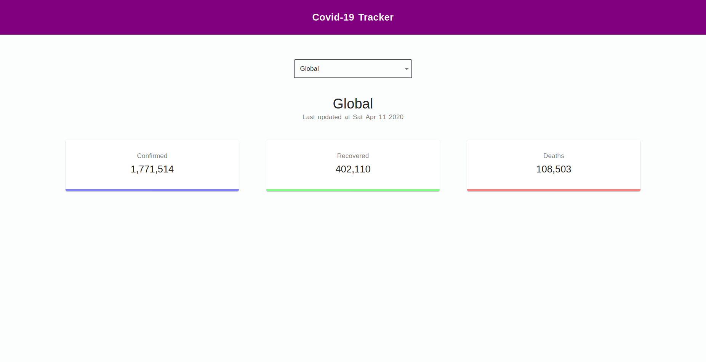
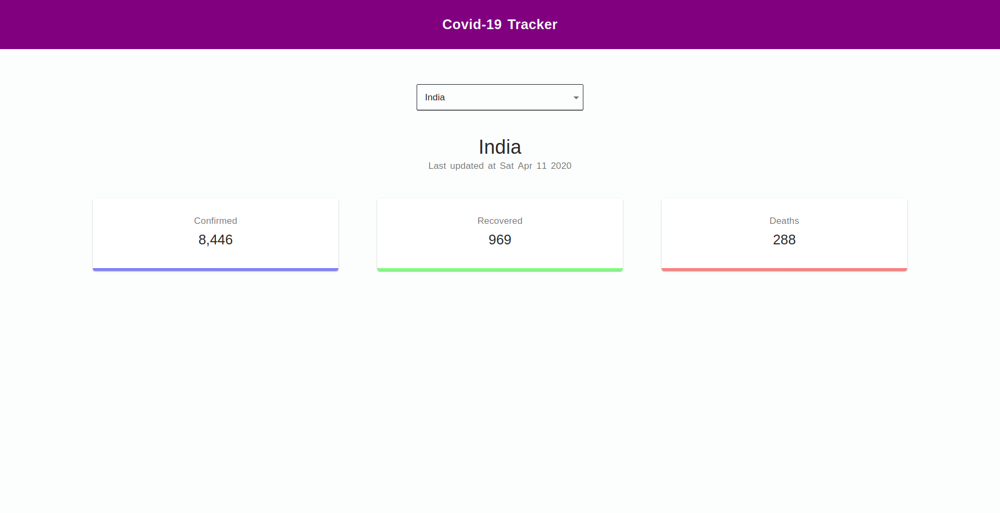
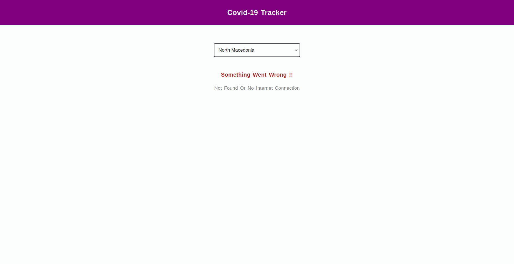

# Corona Tracker App

Corona Tracker Application is developed in [ReactJS](https://reactjs.org/) and [Material-UI](https://material-ui.com/) is used as React UI framework. I have used [Axios](https://www.npmjs.com/package/axios) to make HTTP Request to Covid-19 API. In this application we will get the latest numbers of Coronavirus infected, recovered and deaths Countrywise and globally.

#### Demo : [Link](https://0qyv9.csb.app/)

### Demo Image :

###### 1. Global Covid-19 Status

  

###### 2. India Covid-19 Status

  

###### 3. 404 Not Found

  

#### Install Dependencies :

Clone or download the repo and run command in terminal
`npm install`

#### Run Application

After installing dependencies run command in terminal
`npm start`

### Built With :

- [ReactJS](https://reactjs.org/)
- [Material-UI](https://material-ui.com/)
- [npm axios](https://www.npmjs.com/package/axios)

### Developed By :

- [Shashi Kant Yadav](https://github.com/shashikant712)
